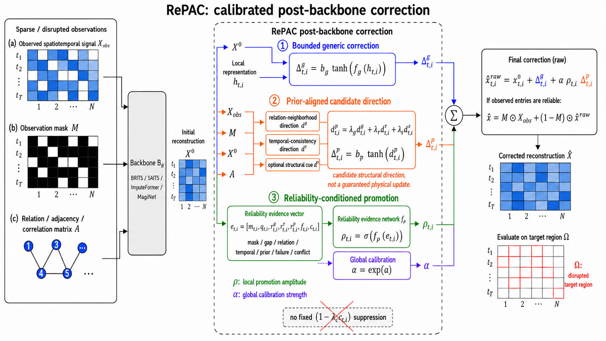
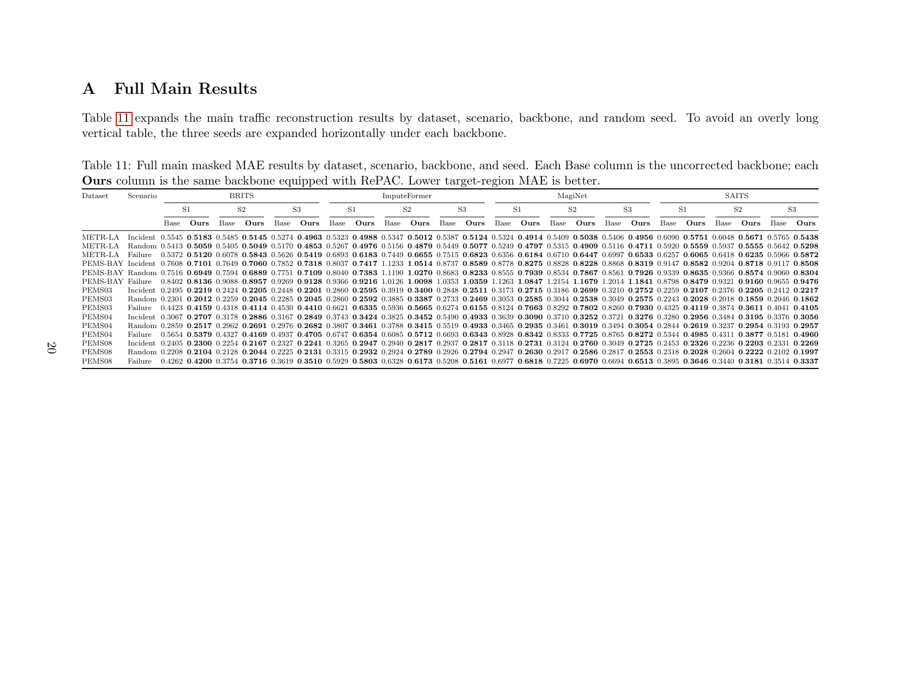
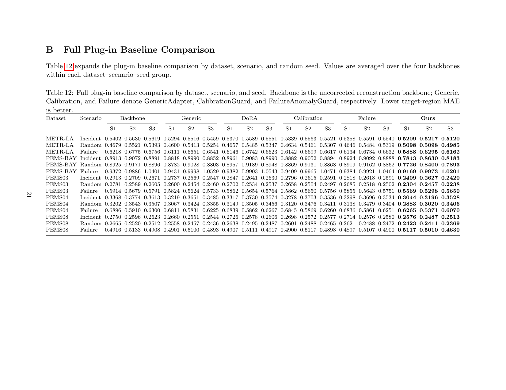
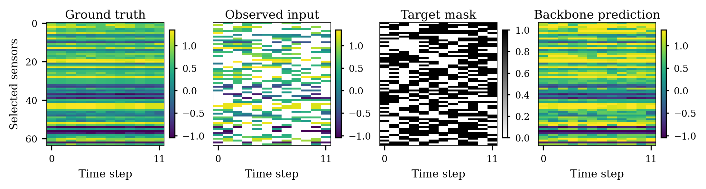
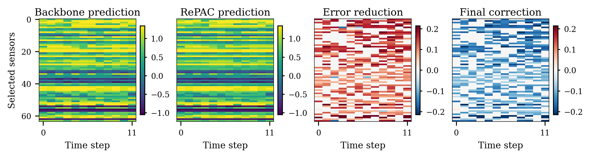
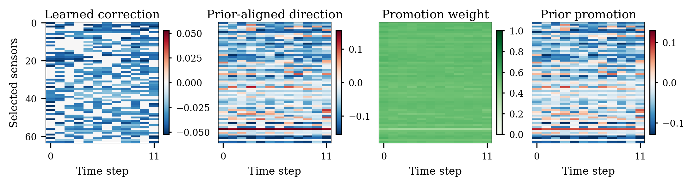

# RePAC

Reliability-conditioned Prior-Aligned Correction for sparse and disrupted
spatiotemporal reconstruction.

**Keywords:** spatiotemporal reconstruction; sparse sensor imputation;
post-backbone correction; reliability-conditioned prior alignment.



## Overview

RePAC is a lightweight post-backbone correction framework. A reconstruction
backbone first produces an initial estimate, and RePAC learns a bounded local
update that combines generic residual correction with a calibrated
prior-aligned candidate direction. The prior direction is not treated as a
guaranteed physical truth; local reliability evidence controls how strongly it
is promoted.

This repository contains the key method implementation, plug-in baselines,
paper result tables, and representative case-study figures. It is intentionally
kept small so the core correction rule is easy to inspect and reuse.

## Highlights

- Post-backbone correction: RePAC can be attached to BRITS, SAITS,
  ImputeFormer, MagiNet, or other reconstruction models.
- Bounded updates: generic and prior-aligned corrections use bounded `tanh`
  branches.
- Reliability-conditioned promotion: local evidence produces `rho`, while a
  learned `alpha = exp(a)` calibrates global promotion strength.
- No hard conflict suppression: conflict cues are learned as evidence rather
  than applied through a fixed multiplier.
- Target-region evaluation: metrics are computed on the protocol-specific
  reconstruction region `Omega`.

## Repository Layout

```text
repac/                 Core RePAC implementation
  model.py             RePAC module and observed-entry anchoring helper
  evidence.py          Local mask, gap, relation, temporal evidence helpers
  priors.py            Modular prior-aligned candidate directions
  baselines.py         Lightweight plug-in baseline modules
  metrics.py           Target-region MAE/RMSE
scripts/
  smoke_test.py        Minimal forward-pass check
  summarize_results.py Result-table summary utility
results/               Locked paper result summaries
assets/                Method overview and representative case figures
tests/                 Minimal unit tests
```

## Installation

```bash
git clone https://github.com/wangyi11111111/RePAC.git
cd RePAC
python -m venv .venv
.venv\\Scripts\\activate  # Windows
pip install -e . -r requirements.txt
```

On Linux or macOS, activate the environment with:

```bash
source .venv/bin/activate
```

## Quick Start

```python
import torch
from repac import RePAC

T, N, C = 12, 8, 2
base = torch.randn(T, N, C)               # backbone reconstruction X^0
generic_features = torch.randn(T, N, 6)   # local representation h
evidence = torch.randn(T, N, 9)           # local reliability evidence e
prior_direction = torch.randn(T, N, C)    # candidate direction d^p

model = RePAC(
    channels=C,
    generic_dim=generic_features.shape[-1],
    evidence_dim=evidence.shape[-1],
)
out = model(base, generic_features, evidence, prior_direction)
print(out.prediction.shape, out.rho.shape, float(out.alpha))
```

Run the minimal smoke test:

```bash
python scripts/smoke_test.py
```

Run unit tests:

```bash
pytest -q
```

## Paper Result Tables

The `results/` directory contains compact CSV summaries used by the manuscript.
The main canonical traffic evaluation uses five datasets, three disruption
protocols, three random seeds, and four reconstruction backbones.

### Table 11: Full Main Results



### Table 12: Full Plug-in Baseline Comparison



Generate a compact terminal summary:

```bash
python scripts/summarize_results.py
```

## Figures

Representative figures are included in `assets/` and displayed below.

### Method Overview


### Representative Case Inputs



### Representative Case Predictions



### Representative Case Mechanism



## Data and Reproducibility Notes

The repository includes locked result summaries and the correction modules. Raw
traffic and sensor datasets are not redistributed. To reproduce full training,
prepare the datasets used in the paper, train a reconstruction backbone, and
pass its initial reconstruction, local representations, masks, relation matrix,
and protocol-specific target region to RePAC.

Observed-entry preservation is protocol-dependent. For standard imputation, the
observation mask can be used as a reliable anchor. For perturbed or noisy
observations, anchoring should be disabled or applied only to the reliable
observed subset.

## Citation

```bibtex
@article{repac2026,
  title   = {Reliability-conditioned Prior-Aligned Correction for Robust Spatiotemporal Reconstruction},
  author  = {Anonymous Authors},
  journal = {Manuscript},
  year    = {2026}
}
```

## License

This repository is released under the MIT License.

